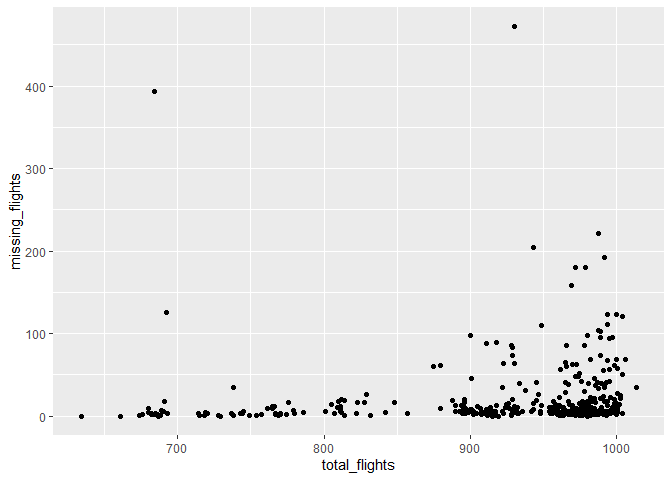
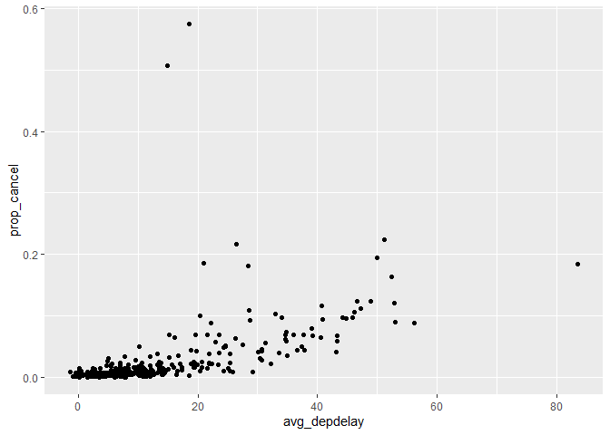
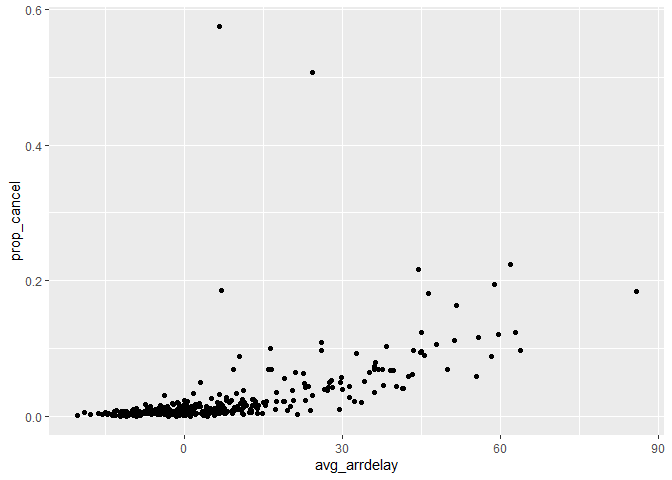

Assignment1
================
Esmma
2022-09-27

## R Markdown

``` r
library(dplyr)
```

    ## 
    ## Attaching package: 'dplyr'

    ## The following objects are masked from 'package:stats':
    ## 
    ##     filter, lag

    ## The following objects are masked from 'package:base':
    ## 
    ##     intersect, setdiff, setequal, union

``` r
library(nycflights13)
```

    ## Warning: package 'nycflights13' was built under R version 4.2.1

``` r
library(ggplot2)
```

``` r
#How many flights have a missing dep_time? What other variables are missing? What might these rows represent?
sum(is.na(flights$dep_time))
```

    ## [1] 8255

``` r
colSums(is.na(flights))
```

    ##           year          month            day       dep_time sched_dep_time 
    ##              0              0              0           8255              0 
    ##      dep_delay       arr_time sched_arr_time      arr_delay        carrier 
    ##           8255           8713              0           9430              0 
    ##         flight        tailnum         origin           dest       air_time 
    ##              0           2512              0              0           9430 
    ##       distance           hour         minute      time_hour 
    ##              0              0              0              0

8255 flights have a missing department time. Other variables that are
missing are dep_delay, arr_time, arr_delay, tailnum, and air_time. These
rows represent a canceled flight.

``` r
#Currently dep_time and sched_dep_time are convenient to look at, but hard to compute with because they’re not really continuous numbers. Convert them to a more convenient representation of number of minutes since midnight.
flights_times <- mutate(flights,
  dep_time_mins = (dep_time %/% 100 * 60 + dep_time %% 100) %% 1440,
  sched_dep_time_mins = (sched_dep_time %/% 100 * 60 +
    sched_dep_time %% 100) %% 1440
)
select(
  flights_times, dep_time, dep_time_mins, sched_dep_time,
  sched_dep_time_mins
)
```

    ## # A tibble: 336,776 × 4
    ##    dep_time dep_time_mins sched_dep_time sched_dep_time_mins
    ##       <int>         <dbl>          <int>               <dbl>
    ##  1      517           317            515                 315
    ##  2      533           333            529                 329
    ##  3      542           342            540                 340
    ##  4      544           344            545                 345
    ##  5      554           354            600                 360
    ##  6      554           354            558                 358
    ##  7      555           355            600                 360
    ##  8      557           357            600                 360
    ##  9      557           357            600                 360
    ## 10      558           358            600                 360
    ## # … with 336,766 more rows

``` r
head(flights_times)
```

    ## # A tibble: 6 × 21
    ##    year month   day dep_time sched_dep_time dep_delay arr_time sched_arr_time
    ##   <int> <int> <int>    <int>          <int>     <dbl>    <int>          <int>
    ## 1  2013     1     1      517            515         2      830            819
    ## 2  2013     1     1      533            529         4      850            830
    ## 3  2013     1     1      542            540         2      923            850
    ## 4  2013     1     1      544            545        -1     1004           1022
    ## 5  2013     1     1      554            600        -6      812            837
    ## 6  2013     1     1      554            558        -4      740            728
    ## # … with 13 more variables: arr_delay <dbl>, carrier <chr>, flight <int>,
    ## #   tailnum <chr>, origin <chr>, dest <chr>, air_time <dbl>, distance <dbl>,
    ## #   hour <dbl>, minute <dbl>, time_hour <dttm>, dep_time_mins <dbl>,
    ## #   sched_dep_time_mins <dbl>

``` r
#Look at the number of canceled flights per day. Is there a pattern? Is the proportion of canceled flights related to the average delay? Use multiple dyplr operations, all on one line, concluding with ggplot(aes(x= ,y=)) + geom_point()
canceled_flights <- flights %>% 
  group_by(year,month,day) %>% 
  mutate(canceled = if_else(
    condition = is.na(dep_time),
    true = T,
    false = F,
    missing = T
  )) %>% 
  summarise(total_flights = n(), missing_flights = sum(canceled))
```

    ## `summarise()` has grouped output by 'year', 'month'. You can override using the
    ## `.groups` argument.

``` r
ggplot(canceled_flights) +
  geom_point(aes(x = total_flights, y = missing_flights)) 
```

<!-- -->

``` r
cancellations_and_delays <- flights %>% 
  group_by(year,month,day) %>% 
  mutate(canceled = if_else(
    condition = is.na(dep_time),
    true = T,
    false = F,
    missing = T
  )) %>% 
  summarise(total = n(), missing = sum(canceled), prop_cancel = mean(canceled),avg_arrdelay = mean(arr_delay, na.rm = T), avg_depdelay = mean(dep_delay,na.rm = T)) %>% 
  ungroup() 
```

    ## `summarise()` has grouped output by 'year', 'month'. You can override using the
    ## `.groups` argument.

``` r
ggplot(cancellations_and_delays) +
  geom_point(aes(x = avg_depdelay, y = prop_cancel ))
```

<!-- -->

``` r
ggplot(cancellations_and_delays) +
  geom_point(aes(x = avg_arrdelay, y = prop_cancel ))
```

<!-- -->

There is a strong increasing relationship between proportion of
cancellations and average departure delay and a strong increasing
relationship between proportion of cancellations and average arrival
delay.
